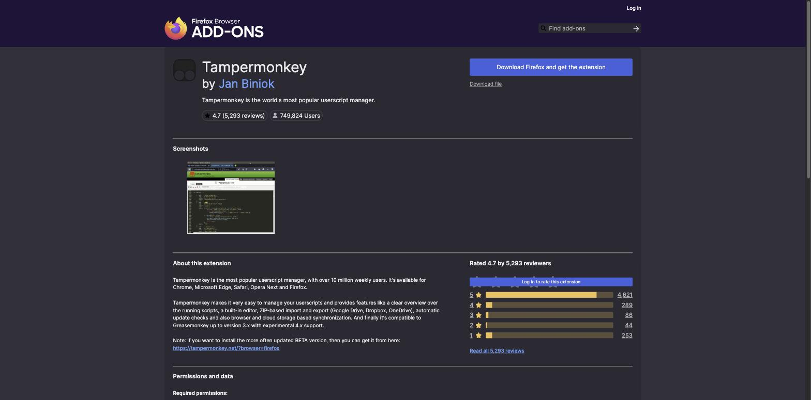
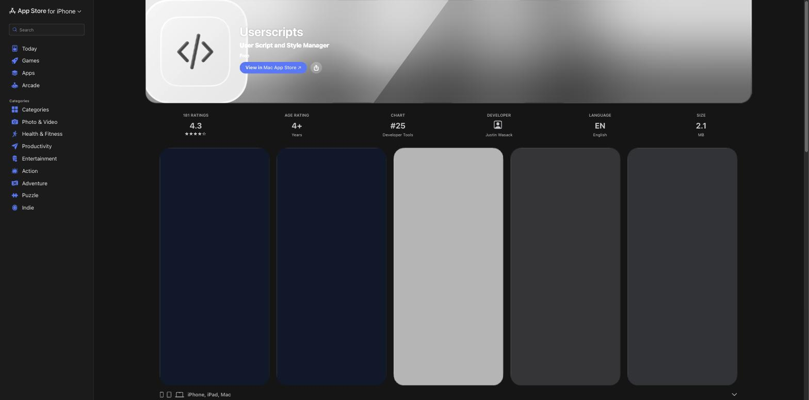

# Installing Shreddit on a phone

Shreddit is a plain userscript, so it needs a userscript manager on your
phone the same way desktop Chrome/Firefox needs Tampermonkey or
Violentmonkey. Support differs a lot between iOS and Android because of how
each platform treats browser extensions.

## Android — Firefox + Tampermonkey (works directly)

Firefox for Android has supported real browser extensions since Firefox
110, so Tampermonkey installs the same way it does on desktop.

1. Install **Firefox** from the Play Store if you don't have it.
2. Open Firefox, go to `Menu (⋮) → Add-ons and themes`.
3. Search for **Tampermonkey**, or open this page directly:
   [addons.mozilla.org/android/addon/tampermonkey](https://addons.mozilla.org/en-US/android/addon/tampermonkey/)

   

4. Tap **Add to Firefox**, then **Add** to confirm.
5. Open the Tampermonkey icon in Firefox's toolbar → **Dashboard** → **+** (Create a new script)
   or **Utilities → Import from file/URL**.
6. Replace the template with the contents of [`shreddit.user.js`](../shreddit.user.js), save.
7. Visit `https://www.reddit.com/` — Shreddit should apply automatically.

Violentmonkey works the same way if you prefer it; both are on the Firefox
Android add-ons store.

## iOS / iPadOS — Safari + a userscript app (Firefox does *not* work)

Firefox for iOS cannot run browser extensions at all — Apple requires every
iOS browser to use WebKit, and Mozilla has never added extension support to
its iOS build, on WebKit or otherwise. Extensions on iOS only work through
**Safari**, via a real Safari App Extension.

Two options, both real Safari App Extensions:

- **Userscripts** (free, open source, by quoid) — recommended default.
- **Tampermonkey for Safari** — official, but paid on iOS unless you
  qualify for a free license (past donation, GitHub contribution, or a
  popular userscript of your own).

### Using Userscripts (free)

1. Install **Userscripts** from the App Store:
   [apps.apple.com/us/app/userscripts/id1463298887](https://apps.apple.com/us/app/userscripts/id1463298887)

   

2. Open **Settings → Safari → Extensions → Userscripts**, turn it on, and
   grant it permission for `reddit.com` (or "All Websites" if you'd rather
   not manage per-site permissions).
3. Open the **Userscripts** app itself, add a new script, and paste in the
   contents of [`shreddit.user.js`](../shreddit.user.js). Save.
4. Open **Safari**, go to `https://www.reddit.com/`, tap the `aA` /
   extensions icon in the address bar, and confirm Userscripts is active
   for the page.

### Using Tampermonkey for Safari

Same shape as above: install from the [App Store](https://apps.apple.com/us/app/tampermonkey/id6738342400),
enable it under **Settings → Safari → Extensions**, open the Tampermonkey
app to add `shreddit.user.js` as a new script, then reload Reddit in
Safari.

## Notes for both platforms

- Requires iOS 15.1+ (for Userscripts/Tampermonkey Safari extensions) or a
  recent Firefox for Android (110+).
- Nothing about Shreddit itself changes on mobile — same DOM-only styling,
  same zero network calls, same `Alt+Shift+M`/`Alt+Shift+D`/`Alt+Shift+T`
  shortcuts if you have a hardware keyboard, otherwise use the toolbar
  buttons directly.
